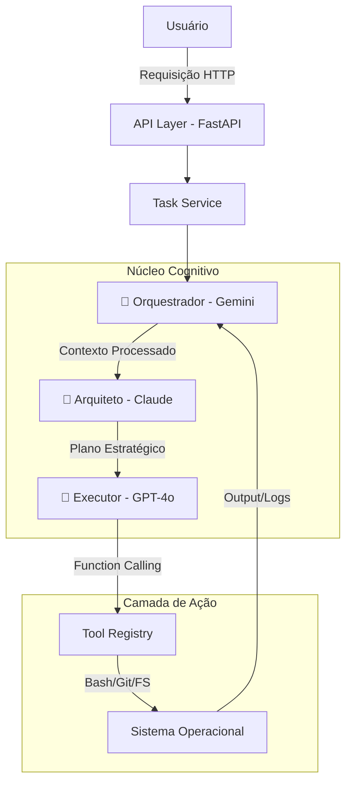

# 🤖 Linux Code Agent: The Trinity Edition
*Onde a Memória Infinita encontra o Planejamento Estratégico e a Precisão Cirúrgica*

<div align="center">
  
  
  
  
  
  **O Auge da Engenharia de Software Autônoma**
</div>

## 🎯 Visão

Esqueça os agentes monolíticos. O Linux Code Agent v0.2.0 inaugura a era da **IA Especializada**, orquestrando os três modelos mais poderosos do mundo em um único fluxo de trabalho contínuo, rodando **100% localmente** na sua máquina.

> ⚡ **TL;DR**: Você é o Diretor Técnico, nós somos sua equipe sênior: um com memória fotográfica, outro com lógica impecável, e um terceiro que executa com precisão cirúrgica.

## 🌟 A Tríade Cognitiva

| Componente | Modelo | Superpoder | Função no Sistema |
|------------|--------|------------|-------------------|
| **🦁 Orquestrador** | Gemini 1.5 Pro | Contexto Infinito (1M+ tokens) | Memória de longo prazo. Lê toda documentação, logs, estrutura de diretórios de uma vez |
| **🧠 Arquiteto** | Claude 3.5 Sonnet | Raciocínio Complexo (Chain-of-Thought) | Planejamento estratégico. Desenha planos passo-a-passo, antecipa edge cases |
| **🤖 Executor** | GPT-4o | Tool Calling Preciso | Execução cirúrgica. Converte planos em comandos com precisão absoluta via JSON |

## 🎬 Demonstração

```python
# Você digita apenas isso:
request = "Refatore o auth.py para usar OAuth2 e adicione testes."

# --- O QUE ACONTECE NOS BASTIDORES ---
# 1. Gemini (Orquestrador): "Lendo auth.py, user_model.py, logs antigos..."
# 2. Claude (Arquiteto): "Estratégia: 1) Criar interface abstrata 2) Implementar Adapter OAuth2..."
# 3. OpenAI (Executor): "Executando: touch app/auth/interfaces.py; pip install python-jose..."

# Resultado: Código limpo, testado e funcional em minutos.
```

## 🚀 Começo Rápido

### Pré-requisitos
- Python 3.10+
- Git
- Chaves de API (Google, Anthropic, OpenAI)

### Instalação (5 minutos)

```bash
# 1. Clone o repositório
git clone https://github.com/yourusername/linux-code-agent.git
cd linux-code-agent/backend

# 2. Ambiente Virtual
python3 -m venv venv
source venv/bin/activate  # Linux/Mac
# venv\Scripts\activate   # Windows

# 3. Instale Dependências
pip install -r requirements.txt

# 4. Configure as Chaves
cat > .env << EOF
GEMINI_API_KEY=AIzaSy...
ANTHROPIC_API_KEY=sk-ant...
OPENAI_API_KEY=sk-proj...
LLM_PROVIDER=multi_agent_trinity
EOF

# 5. Inicie o Servidor
python3 -m app.app
```

📡 **Servidor**: http://localhost:8000  
📚 **Docs**: http://localhost:8000/docs

### VS Code Extension

Para executar a extensão do VS Code, siga estas etapas:

1.  **Navegue até o diretório da extensão**:
    ```bash
    cd ../vscode-extension
    ```

2.  **Instale as dependências**:
    ```bash
    npm install
    ```

3.  **Compile a extensão**:
    ```bash
    npm run compile
    ```

4.  **Abra o VS Code no diretório da extensão**:
    ```bash
    code .
    ```

5.  **Inicie a extensão**:
    - Pressione `F5` para abrir uma nova janela do "Extension Development Host" com a extensão em execução.

6.  **Use a extensão**:
    - Na nova janela do VS Code, abra a paleta de comandos (`Ctrl+Shift+P` ou `Cmd+Shift+P`).
    - Procure e selecione o comando `Linux Code Agent: Execute Task`.
    - Insira um objetivo para a tarefa e pressione `Enter`.


## ✨ Características

### ✅ **Atual (v0.2.0)**

#### Core Funcional
- [x] **Tríade Multi-Modelo** - Integração nativa Gemini/Claude/OpenAI
- [x] **Execução Real** - Shell, filesystem, git operations
- [x] **API REST Completa** - FastAPI com OpenAPI/Swagger
- [x] **Background Tasks** - Execução assíncrona robusta
- [x] **Singleton Provider** - Gerenciamento otimizado para latência zero
- [x] **Retry Exponencial** - Backoff inteligente para rate limits

#### Tools Disponíveis
- [x] **Shell** - Comandos bash complexos
- [x] **FileSystem** - Crie, edite, delete arquivos
- [x] **Git** - Status, commit, log, diff, branch management

### 🔮 **Futuro Próximo (v0.3.0)**

#### Agentes Especialistas
- [ ] **Frontend Agent** - Screenshots → código React/Vue
- [ ] **DevOps Agent** - Pipelines CI/CD, Dockerfiles, K8s manifests
- [ ] **QA Agent** - Geração automática de testes com cobertura garantida

## 🏗️ Arquitetura



## 💡 Exemplos de Uso

### 1. Auditoria e Refatoração Completa
```python
import requests

response = requests.post("http://localhost:8000/tasks", json={
    "objective": "Analise todo o diretório /src. Identifique acoplamento alto entre 'users' e 'payments'. Refatore criando uma camada de serviço intermediária.",
    "context": {"root_dir": "./src"}
})
print(f"Task ID: {response.json()['id']}")
```

### 2. DevOps Setup Automático
```bash
curl -X POST http://localhost:8000/tasks \
  -H "Content-Type: application/json" \
  -d '{
    "objective": "Dockerize esta aplicação Python. Crie Dockerfile multi-stage, docker-compose.yml com Redis e script Makefile."
  }'
```

## 🆚 Comparativo de Mercado

| Feature | GitHub Copilot | Devin (Cognition) | **Linux Code Agent** |
|---------|---------------|-------------------|---------------------|
| Arquitetura | Single Model | Proprietary | **Multi-Model Trinity** |
| Contexto | Limitado | Alto | **Infinito (Gemini 1M+)** |
| Execução | Sugestões | Sandbox Remoto | **Local Real** |
| Privacidade | Cloud Telemetry | Cloud Only | **100% Local** |
| Custo | $10-19/mês | $$$$ | **Grátis (Open Source)** |

## 🗺️ Roadmap Visionário

### Q2 2026 - Especialização Profunda
- [ ] **Self-Healing** - Detecta erros em produção e propõe hotfixes em tempo real
- [ ] **Multi-Step Planning** - Tarefas complexas quebradas em sprints de execução
- [ ] **Memory Persistente** - SQLite Vector Store para decisões passadas

### Q3 2026 - Interface & Colaboração
- [ ] **VSCode Extension** - Chat na IDE que entende seu workspace completo
- [ ] **Comando de Voz** - "Linux Agent, faça deploy em produção" com autenticação por voz
- [ ] **Plugins de Terceiros** - Marketplace para tools customizadas

## 🔐 Segurança & Responsabilidade

Este é um agente autônomo que executa ações reais no seu sistema.

### ✅ Segurança Garantida
- **API Keys Locais** - Armazenadas apenas no seu `.env`
- **Thread-Safe** - Gerenciamento seguro de estado
- **Sandbox (Em breve)** - Containers isolados para código não confiável

### ⚠️ Recomendações
- Sempre revise o código gerado
- Use em ambiente controlado
- Teste em branch separado antes de produção

## 🤝 Contribuição

Este projeto é Open Source e vive da comunidade.

1. **Fork** o projeto
2. **Crie sua Feature Branch** (`git checkout -b feature/AmazingFeature`)
3. **Commit** suas mudanças (`git commit -m 'Add some AmazingFeature'`)
4. **Push** para a Branch (`git push origin feature/AmazingFeature`)
5. **Abra um Pull Request**

📘 Veja nosso [Guia de Contribuição](CONTRIBUTING.md) para detalhes técnicos.

## 📞 Suporte

- **Issues**: [GitHub Issues](https://github.com/yourusername/linux-code-agent/issues)
- **Discord**: [Comunidade Discord](#) *(em breve)*
- **Documentação**: [Docs Completas](docs/README.md)

---

<div align="center">
  <strong>Linux Code Agent</strong><br>
  <em>Não codifique mais. Arquiteture.</em><br><br>
  Feito com ❤️ pela comunidade Open Source
</div>

---
*Última atualização: v0.2.0 | [Ver Changelog](CHANGELOG.md)*